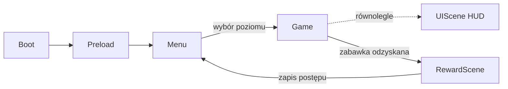

# Dokumentacja Implementacyjna: Poszukiwacze Zaginionych Zabawek

> Dokument techniczny uzupełniający [GDD](Plan_Gry_Poszukiwacze_Zaginionych_Zabawek.md).
> Opisuje architekturę, proponowane rozwiązania i plan wdrożenia gry w silniku **Phaser 3 + TypeScript**.

---

## 1. Stack Technologiczny

| Warstwa | Wybór | Uzasadnienie |
|---|---|---|
| Silnik | **Phaser 3.80+** | Dojrzały silnik 2D web, wbudowana fizyka platformowa (Arcade), tilemapy, particles, audio, gamepad. |
| Język | **TypeScript** | Bezpieczeństwo typów przy rosnącej liczbie scen/obiektów; świetne wsparcie w VS Code. |
| Bundler / dev-server | **Vite** | Natychmiastowy hot-reload — kluczowy przy strojeniu skoków i playtestach z dziećmi. |
| Fizyka | **Arcade Physics** | AABB w zupełności wystarcza dla platformówki bez obrażeń; prostsza i szybsza niż Matter.js. |
| Edytor poziomów | **Tiled** (format `.tmj` / JSON) | Wizualne układanie platform, warstwy obiektów (cukierki, duszki, checkpointy), natywny import w Phaser. |
| Grafika | AI-generated (styl kredkowy wg. konceptów) + **TexturePacker / free-tex-packer** | Atlasy tekstur = mniej draw calls, jedna paczka na poziom. |
| Audio | Wbudowane audio Phaser (Web Audio API) | Formaty: `.ogg` + fallback `.mp3`. Nagrania głosu rodzica jako zwykłe pliki audio. |
| Zapis postępu | `localStorage` | Wystarczy do zapamiętania odzyskanych zabawek i ukończonych poziomów; zero backendu. |
| Dystrybucja | Statyczny hosting (np. itch.io, GitHub Pages) lub uruchamianie lokalne | Gra działa w każdej przeglądarce, bez instalacji. Opcjonalnie później Electron/Tauri na desktop. |

**Docelowa rozdzielczość:** 1280×720 (16:9), `Scale.FIT` + `autoCenter` — skaluje się do każdego ekranu, w tym TV.

---

## 2. Architektura Projektu

### 2.1. Struktura katalogów

```
the-lost-toy-seekers/
├── index.html
├── package.json / tsconfig.json / vite.config.ts
├── public/
│   └── assets/
│       ├── atlas/          # atlasy tekstur (level1.png + level1.json, ui.png...)
│       ├── tilemaps/       # mapy z Tiled (level1.tmj ... level4.tmj)
│       ├── audio/
│       │   ├── sfx/        # skok, cukierek, chichot duszka, "plum" do wody
│       │   ├── voice/      # nagrania rodzica: brawo.ogg, sprobuj.ogg...
│       │   └── music/      # spokojne pętle muzyczne per poziom
│       └── fonts/          # bitmap font (tylko liczby do licznika)
└── src/
    ├── main.ts             # konfiguracja Phaser.Game
    ├── config/
    │   ├── constants.ts    # grawitacja, prędkości, wysokość skoku (JEDNO miejsce strojenia!)
    │   └── levels.ts       # manifest poziomów (klucze map, muzyka, zabawka-nagroda)
    ├── scenes/
    │   ├── BootScene.ts    # minimalne assety (logo, pasek ładowania)
    │   ├── PreloadScene.ts # ładowanie paczki danego poziomu z paskiem postępu
    │   ├── MenuScene.ts    # mapka-ogród z wyborem poziomu (ikony, zero tekstu)
    │   ├── GameScene.ts    # właściwa rozgrywka (jedna scena, dane poziomu z Tiled)
    │   ├── UIScene.ts      # HUD jako osobna scena-nakładka (licznik, portrety, postęp zabawek)
    │   └── RewardScene.ts  # celebracja odzyskania zabawki na końcu poziomu
    ├── objects/
    │   ├── Player.ts       # klasa bazowa gracza (ruch, skok, squash&stretch)
    │   ├── PlayerOne.ts    # 7-latek: interakcje (dźwignie, pchanie bloków)
    │   ├── PlayerTwo.ts    # 5-latek: magiczna latarka
    │   ├── Ghost.ts        # Duszek-Psotnik (patrol, chichot, puf brokatu)
    │   ├── Candy.ts        # znajdźki
    │   ├── HiddenObject.ts # obiekty odkrywane latarką
    │   └── interactive/    # Lever.ts, PushBlock.ts, Bubble.ts, MushroomTrampoline.ts...
    ├── systems/
    │   ├── InputManager.ts     # mapowanie klawiatura (2 os.) + gamepady
    │   ├── CoopCamera.ts       # kamera śledząca oboje graczy
    │   ├── RescueSystem.ts     # "brak śmierci": strefy ratunkowe + checkpointy
    │   ├── FlashlightSystem.ts # logika magicznej latarki
    │   ├── AudioManager.ts     # SFX, muzyka, kolejka komunikatów głosowych
    │   └── SaveManager.ts      # localStorage (postęp, odzyskane zabawki)
    └── utils/
        └── juice.ts        # helpery: tween-bounce, particle-burst, flash
```

### 2.2. Przepływ scen



**Kluczowa decyzja:** jedna generyczna `GameScene` sterowana danymi (mapa z Tiled + manifest z `levels.ts`), zamiast czterech osobnych scen. Nowy poziom = nowa mapa w Tiled, zero nowego kodu. `UIScene` działa równolegle nad `GameScene` (wzorzec Phaser "parallel scene"), więc HUD nie miesza się z kamerą świata gry.

---

## 3. Rozwiązania Kluczowych Mechanik

### 3.1. Dwóch graczy na jednym ekranie

* **Sterowanie:** Gracz 1 → strzałki, Gracz 2 → WASD; automatyczne przejęcie przez pady, gdy Phaser wykryje `gamepadconnected`. Mapowanie w jednym miejscu (`InputManager`), by łatwo zamienić strony.
* **Kamera kooperacyjna (`CoopCamera`)** — najlepsze rozwiązanie dla małych dzieci to **jedna wspólna kamera** (split-screen dezorientuje):
  * kamera celuje w punkt środkowy między graczami,
  * zoom dobierany dynamicznie tak, by oboje mieścili się w kadrze (z limitem min/max),
  * **"magiczna bańka":** jeśli mimo maks. oddalenia gracz wypada poza kadr (np. młodszy został z tyłu), po 2 s zostaje delikatnie przeniesiony w bańce do drugiego gracza — z dźwiękiem "bąbelka", jako element zabawy, nie kara. Eliminuje to 90% frustracji w co-opie dzieci.
* Poziomy projektowane **głównie horyzontalnie** z łagodnym pionem (poza poziomem 4), co ułatwia pracę wspólnej kamery.

### 3.2. Brak śmierci — `RescueSystem`

```ts
// Niewidzialna strefa ratunkowa pod mapą + strefy "mokre" (kałuże)
rescueZone.onOverlap(player, () => {
  audio.playRandom(['boing', 'plum', 'wiii']);      // śmieszny dźwięk
  player.disableControlFor(600);                     // krótki brak kontroli
  tweens.arcTo(player, lastCheckpoint[player.id]);   // łuk powrotny + gwiazdki
});
```

* Checkpointy to obiekty na warstwie Tiled (`checkpoint`), zapisywane per gracz — każdy wraca na **swój** ostatni bezpieczny grunt.
* Żadnego HP, liczników żyć ani ekranów porażki. Ekrany z konceptów pokazujące serduszka traktujemy wyłącznie jako dekorację lub w ogóle pomijamy — zgodnie z GDD sekcja 2.1.

### 3.3. Magiczna latarka (Gracz 2)

* Jeden przycisk (np. `Spacja`/dolny przycisk pada) — **przytrzymanie włącza krąg światła** wokół Gracza 2.
* Implementacja: obiekty `HiddenObject` (mosty, znajdźki) renderowane z `alpha: 0.15` + delikatny "szept" wizualny (pulsujący zarys co kilka sekund, żeby dziecko wiedziało, że coś tam jest). W zasięgu światła: tween `alpha → 1` i włączenie kolizji.
* Efekt światła: `Phaser.GameObjects.Light` (pipeline Light2D) **lub prostszy fallback** — maskowana tekstura poświaty. Rekomendacja: zacząć od maski (prostsze, pewne na każdym sprzęcie), Light2D tylko jeśli wydajność pozwoli.
* Ukryty most pozostaje aktywny ~3 s po zgaśnięciu światła (grace period), żeby 5-latek nie musiał precyzyjnie synchronizować.

### 3.4. Duszki-Psotniki

* Prosta maszyna stanów: `patrol → (kontakt z graczem) → giggle → drop-candy → poof`.
* Patrol: ruch wahadłowy między dwoma punktami z warstwy Tiled — bez pathfindingu, zbędna złożoność.
* Przy kontakcie: chichot (losowy z 3 wariantów), spawn `Candy` z podskokiem, emitter cząsteczek "brokat", znikanie. Respawn po 10–15 s w chmurce, by poziom nie pustoszał.

### 3.5. Elementy kooperacji (dźwignie, bloki, tama)

* Wspólny interfejs `Interactive` z metodą `activate(player)` — dźwignie i przyciski filtrują, który gracz może ich użyć (`allowedPlayer` z właściwości obiektu w Tiled).
* **Przycisk przytrzymywany** (tama w poziomie 2): aktywny, dopóki Gracz 1 na nim stoi — czysta kolizja Arcade, zero timerów.
* **Pchane bloki:** `immovable` + ręczne przesuwanie przy kolizji z Graczem 1 (Arcade nie ma prawdziwego pchania — prosty snap do siatki 32 px daje przewidywalność lepszą niż fizyka).

### 3.6. Znajdźki i nagrody

* Cukierki: grupa Arcade z `overlap` → dźwięk + licznik + particle burst + tween "wessania" do HUD.
* Nagroda-zabawka na końcu poziomu: przejście do `RewardScene` — duża grafika zabawki, konfetti, fanfary, głos rodzica "Brawo!", wypełnienie konturu zabawki w HUD. `SaveManager` zapisuje postęp.

---

## 4. Pipeline Assetów (AI → Gra)

Styl docelowy wg. konceptów: **kredkowy rysunek, nocny ogród, ciepłe kolory** (patrz [Gemini_Generated_Image_6d2trv6d2trv6d2t.png](Gemini_Generated_Image_6d2trv6d2trv6d2t.png)).

1. **Spójność stylu:** jeden bazowy prompt-szablon (styl, paleta, "children's crayon storybook, night garden, soft outlines") + wariacje per asset. Zapisywać prompty w `docs/prompts.md` — to jedyny sposób na spójne dogenerowanie brakujących elementów za miesiąc.
2. **Rodzaje assetów i wymagania techniczne:**
   | Typ | Format | Uwagi |
   |---|---|---|
   | Tileset ziemi/platform | PNG, kafle 64×64, **z 1px extrude** | extrude eliminuje szwy między kaflami przy zoomie kamery |
   | Tła paralaksy | PNG, 3 warstwy (niebo / drzewa / krzaki), tileable w poziomie | `TileSprite` + `scrollFactor` 0.1 / 0.3 / 0.6 |
   | Postacie | klatki 128×128 → atlas | animacje: idle, run (4–6 kl.), jump, land; AI generuje pozy, dopracowanie w Aseprite/Krita |
   | Duszki, cukierki, UI | pojedyncze PNG z alfa → atlas | usuwanie tła: rembg / Photoroom |
3. **Pakowanie:** `free-tex-packer` (darmowy) → jeden atlas na poziom + wspólny atlas UI/postaci.
4. **Audio:** SFX z freesound.org (CC0) + nagrania głosu rodzica (telefon wystarczy; normalizacja w Audacity, eksport `.ogg` 96 kbps).

---

## 5. Pipeline Poziomów (Tiled)

* Warstwy w każdej mapie `.tmj`:
  * `ground` (tile layer, kolizje przez właściwość `collides: true`),
  * `oneway` (platformy przenikalne od dołu — `checkCollision.down` only),
  * `objects` (object layer: spawny graczy, cukierki, duszki + punkty patrolu, checkpointy, interaktywne, `hidden` dla latarki, strefa mety z zabawką),
  * `decor` (czysto wizualna).
* `GameScene` czyta mapę generycznie — **projektant poziomu (Ty) nie dotyka kodu**, tylko Tiled.
* Metryki platform wynikają ze strojenia skoku (Krok 2 poniżej): maks. odległość skoku i wysokość zapisane w `constants.ts` i **naniesione jako szablon-linijka w Tiled**, żeby każdy skok był fizycznie wykonalny dla 5-latka (projektować na ~70% maksymalnego zasięgu skoku).

---

## 6. UI/HUD (bez tekstu)

* `UIScene` nad grą: licznik cukierków (ikona + bitmapowa liczba), portrety graczy (uśmiech ↔ zdziwienie przy wpadce), pasek postępu zabawek (4 kontury wypełniane kolorem).
* Menu poziomów: rysunkowa mapka ogrodu, poziomy jako duże "przystanki" z obrazkiem motywu; zablokowane = szare z kłódką-chmurką. Klik/wybór padem — zero czytania.
* Pauza: jeden duży przycisk ⏸ / `Esc` — obraz zamiera, delikatne rozmycie, dwie ikony: ▶ i 🏠.

---

## 7. Polerowanie (Juiciness) — checklista

- [ ] Squash & stretch przy skoku i lądowaniu (tween skali, 100 ms)
- [ ] Chmurka kurzu przy lądowaniu (particle emitter, 5–8 cząstek)
- [ ] Cukierki: rotacja + sinusoidalne unoszenie; przy zebraniu lot do licznika HUD
- [ ] Brokat duszków, konfetti w `RewardScene`
- [ ] Świetliki w tle (particles z łagodnym ruchem — jak na konceptach)
- [ ] Delikatny "camera bump" przy odbiciu z grzyba-trampoliny
- [ ] Wszystkie dźwięki z lekko losowym pitch (0.95–1.05) — nie nużą przy powtórkach

---

## 8. Plan Wdrożenia — Kamienie Milowe

Kolejność zoptymalizowana pod zasadę: **najpierw grywalny prototyp, grafika na końcu** (rozszerzenie Kroków 1–5 z GDD).

### M0 — Szkielet projektu (~1 wieczór)
Vite + TS + Phaser, sceny Boot/Preload/Game, pusty poziom z kolorowych prostokątów, postać skacząca po platformach.

### M1 — Rdzeń ruchu i strojenie (1–2 wieczory) ⭐ najważniejszy etap
Dwóch graczy na klawiaturze, `CoopCamera`, `RescueSystem`. **Strojenie skoku z dziećmi na szarych klockach** — wartości do `constants.ts`. Kryterium ukończenia: 5-latek samodzielnie przechodzi testowy tor.

### M2 — Pętla rozgrywki (2–3 wieczory)
Import map z Tiled, cukierki + HUD, duszki, meta z nagrodą, `SaveManager`, menu wyboru poziomów. Kryterium: pełne przejście "szarego" poziomu 1 od menu do nagrody.

### M3 — Mechaniki kooperacji (2–3 wieczory)
Magiczna latarka + obiekty ukryte, dźwignie/przyciski/pchane bloki, bąbelki i pływające liście (poziom 2), trampoliny-grzyby (poziom 4).

### M4 — Poziomy w Tiled (3–4 wieczory)
Greybox wszystkich 4 poziomów zgodnie z GDD sekcja 4 + playtest każdego z dziećmi **przed** art passem (przesuwanie platform w Tiled jest darmowe, po oklejeniu grafiką — bolesne).

### M5 — Art pass (2–4 wieczory, równolegle z generowaniem AI)
Generowanie i pakowanie assetów (sekcja 4), podmiana greyboxu, paralaksa, animacje postaci, muzyka i SFX, nagrania głosowe.

### M6 — Polish i playtesty finalne (1–2 wieczory)
Checklista z sekcji 7, obserwacja dzieci przy pełnym przejściu, korekty trudności, build produkcyjny (`vite build`) i wrzucenie na hosting/itch.io.

> **Zasada żelazna:** po każdym milestone gra musi się uruchamiać i być grywalna. Dzieci mogą (i powinny!) grać w wersję "z kwadratów" już po M1.

---

## 9. Ryzyka i Decyzje Odłożone

| Ryzyko | Mitygacja |
|---|---|
| Niespójność grafik AI między sesjami generowania | Bank promptów + generowanie assetów jednego poziomu w jednej sesji; ewentualnie referencyjny obraz stylu |
| Skoki za trudne dla 5-latka | Coyote time (~120 ms) + jump buffering (~150 ms) wbudowane od M1; projektowanie na 70% zasięgu skoku |
| Wydajność Light2D na słabszym sprzęcie | Start od wariantu z maską; Light2D jako opcjonalne ulepszenie |
| Dwóch graczy na jednej klawiaturze — ghosting klawiszy | Test konkretnej klawiatury wcześnie (M1); pady jako plan B |
| Zakres rośnie ("jeszcze jeden poziom!") | Generyczna GameScene + Tiled sprawiają, że nowe poziomy to tylko content — ale dopiero po M6 |

---

## 10. Pierwsze Komendy

```bash
npm create vite@latest . -- --template vanilla-ts
npm install phaser
npm run dev
```

Następny krok po akceptacji tej dokumentacji: **M0 — szkielet projektu**.
