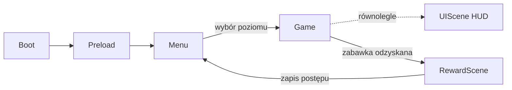

# Dokumentacja Implementacyjna: Poszukiwacze Zaginionych Zabawek

> Dokument techniczny uzupełniający [GDD](Plan_Gry_Poszukiwacze_Zaginionych_Zabawek.md).
> Opisuje architekturę, proponowane rozwiązania i plan wdrożenia gry w silniku **Phaser 3 + TypeScript**.

---

## 1. Stack Technologiczny

| Warstwa | Wybór | Uzasadnienie |
|---|---|---|
| Silnik | **Phaser 3.80+** | Dojrzały silnik 2D web, wbudowana fizyka platformowa (Arcade), tilemapy, particles, audio, gamepad. |
| Język | **TypeScript** | Bezpieczeństwo typów przy rosnącej liczbie scen/obiektów; świetne wsparcie w VS Code. |
| Bundler / dev-server | **Vite** | Natychmiastowy hot-reload — kluczowy przy strojeniu skoków i playtestach z dziećmi. |
| Fizyka | **Arcade Physics** | AABB w zupełności wystarcza dla platformówki bez obrażeń; prostsza i szybsza niż Matter.js. |
| Edytor poziomów | **Tiled** (format `.tmj` / JSON) | Wizualne układanie platform, warstwy obiektów (cukierki, duszki, checkpointy), natywny import w Phaser. |
| Grafika | **Rysowana wektorowo (SVG)**, ładowana przez `this.load.svg` | Zero pipeline'u: brak atlasów, usuwania tła i postprocessingu. Edycja assetu = edycja pliku tekstowego, wersjonowalna w gicie. Patrz [Styleguide_Wektorowy.md](Styleguide_Wektorowy.md). |
| Audio | Wbudowane audio Phaser (Web Audio API) | Formaty: `.ogg` + fallback `.mp3`. Nagrania głosu rodzica jako zwykłe pliki audio. |
| Zapis postępu | `localStorage` | Wystarczy do zapamiętania odzyskanych zabawek i ukończonych poziomów; zero backendu. |
| Dystrybucja | Statyczny hosting (np. itch.io, GitHub Pages) lub uruchamianie lokalne | Gra działa w każdej przeglądarce, bez instalacji. Opcjonalnie później Electron/Tauri na desktop. |

**Docelowa rozdzielczość:** 1280×720 (16:9), `Scale.FIT` + `autoCenter` — skaluje się do każdego ekranu, w tym TV.

---

## 2. Architektura Projektu

### 2.1. Struktura katalogów

```
the-lost-toy-seekers/
├── index.html
├── package.json / tsconfig.json / vite.config.ts
├── tools/
│   └── generate-sfx.mjs    # synteza „greyboxu dźwięku" (npm run sfx, sekcja 4)
├── public/
│   ├── asset_preview.html  # podgląd assetów (narzędzie dev, patrz Styleguide sekcja 7)
│   └── assets/
│       ├── svg/            # assety gry — pliki SVG (char_*, world_*, pickup_*, ui_*)
│       ├── tilemaps/       # mapy z Tiled (level1.tmj ... level4.tmj)
│       ├── audio/
│       │   ├── sfx/        # skok, cukierek, chichot duszka, "plum" do wody
│       │   ├── voice/      # nagrania rodzica: brawo.ogg, sprobuj.ogg...
│       │   └── music/      # spokojne pętle muzyczne per poziom
│       └── fonts/          # bitmap font (tylko liczby do licznika)
└── src/
    ├── main.ts             # konfiguracja Phaser.Game
    ├── config/
    │   ├── constants.ts    # grawitacja, prędkości, wysokość skoku (JEDNO miejsce strojenia!)
    │   ├── levels.ts       # manifest poziomów (klucze map, muzyka, zabawka-nagroda)
    │   └── audio.ts        # manifest efektów dźwiękowych (plik, głośność)
    ├── scenes/
    │   ├── BootScene.ts    # minimalne assety (logo, pasek ładowania)
    │   ├── PreloadScene.ts # ładowanie paczki danego poziomu z paskiem postępu
    │   ├── MenuScene.ts    # mapka-ogród z wyborem poziomu (ikony, zero tekstu)
    │   ├── GameScene.ts    # właściwa rozgrywka (jedna scena, dane poziomu z Tiled)
    │   ├── UIScene.ts      # HUD jako osobna scena-nakładka (licznik, portrety, postęp zabawek)
    │   └── RewardScene.ts  # celebracja odzyskania zabawki na końcu poziomu
    ├── objects/
    │   ├── Player.ts       # klasa bazowa gracza (ruch, skok, squash&stretch)
    │   ├── PlayerOne.ts    # 7-latek: interakcje (dźwignie, pchanie bloków)
    │   ├── PlayerTwo.ts    # 5-latek: magiczna latarka
    │   ├── Ghost.ts        # Duszek-Psotnik (patrol, chichot, puf brokatu)
    │   ├── Candy.ts        # znajdźki
    │   ├── HiddenObject.ts # obiekty odkrywane latarką
    │   └── interactive/    # Lever.ts, PushBlock.ts, Bubble.ts, MushroomTrampoline.ts...
    ├── systems/
    │   ├── InputManager.ts     # mapowanie klawiatura (2 os.) + gamepady
    │   ├── CoopCamera.ts       # kamera śledząca oboje graczy
    │   ├── RescueSystem.ts     # "brak śmierci": strefy ratunkowe + checkpointy
    │   ├── FlashlightSystem.ts # logika magicznej latarki
    │   ├── AudioManager.ts     # SFX, muzyka, kolejka komunikatów głosowych
    │   └── SaveManager.ts      # localStorage (postęp, odzyskane zabawki)
    └── utils/
        ├── juice.ts        # helpery: tween-bounce, particle-burst, flash
        ├── digits.ts       # bitmapowe cyfry licznika (jedyny „tekst" w grze)
        └── physics.ts      # rozmiar ciała Arcade w pikselach świata (sekcja 3.7)
```

### 2.2. Przepływ scen



**Kluczowa decyzja:** jedna generyczna `GameScene` sterowana danymi (mapa z Tiled + manifest z `levels.ts`), zamiast czterech osobnych scen. Nowy poziom = nowa mapa w Tiled, zero nowego kodu. `UIScene` działa równolegle nad `GameScene` (wzorzec Phaser "parallel scene"), więc HUD nie miesza się z kamerą świata gry.

---

## 3. Rozwiązania Kluczowych Mechanik

### 3.1. Dwóch graczy na jednym ekranie

* **Sterowanie:** Gracz 1 → strzałki, Gracz 2 → WASD; automatyczne przejęcie przez pady, gdy Phaser wykryje `gamepadconnected`. Mapowanie w jednym miejscu (`InputManager`), by łatwo zamienić strony.
* **Kamera kooperacyjna (`CoopCamera`)** — najlepsze rozwiązanie dla małych dzieci to **jedna wspólna kamera** (split-screen dezorientuje):
  * kamera celuje w punkt środkowy między graczami,
  * zoom dobierany dynamicznie tak, by oboje mieścili się w kadrze (z limitem min/max),
  * **"magiczna bańka":** jeśli mimo maks. oddalenia gracz wypada poza kadr (np. młodszy został z tyłu), po 2 s zostaje delikatnie przeniesiony w bańce do drugiego gracza — z dźwiękiem "bąbelka", jako element zabawy, nie kara. Eliminuje to 90% frustracji w co-opie dzieci.
* Poziomy projektowane **głównie horyzontalnie** z łagodnym pionem (poza poziomem 4), co ułatwia pracę wspólnej kamery.

**Pułapka: squash & stretch potrafi zerwać kontakt z gruntem.** Arcade skaluje ciało
fizyczne razem ze sprite'em:

```
height     = sourceHeight * scaleY
position.y = y + scaleY * (offset.y - displayOriginY)
```

Przy zaczepieniu w środku postaci (`displayOriginY = PLAYER_HEIGHT / 2`) spłaszczenie na
lądowaniu unosiło dolną krawędź ciała o kilka pikseli. Postać odklejała się od podłoża,
spadała, lądowała ponownie — i tak w kółko, co wyglądało jak **drżenie postaci** i psuło
też coyote time. Korygowanie rozmiaru ciała co klatkę nie pomaga: `Body.setSize()` liczy
z **zapamiętanej** skali (`_sx`, `_sy`), więc korekta zawsze spóźnia się o klatkę względem
tweena.

Rozwiązanie: **postacie zaczepiamy na stopach** (`setOrigin(0.5, 1)`). Wtedy
`displayOriginY = PLAYER_HEIGHT`, `offset.y = 0`, a dolna krawędź ciała wychodzi po prostu
`y` — niezależnie od skali. Sprzężenie znika z samej matematyki i przy okazji tak wygląda
poprawny squash: postać ugina się do ziemi, zamiast zapadać w siebie. Konsekwencja dla map:
punkty z warstwy `objects` są **wprost** miejscem, gdzie gracz stanie (patrz sekcja 5).

### 3.2. Brak śmierci — `RescueSystem`

```ts
// Niewidzialna strefa ratunkowa pod mapą + strefy "mokre" (kałuże)
rescueZone.onOverlap(player, () => {
  audio.playRandom(['boing', 'plum', 'wiii']);      // śmieszny dźwięk
  player.disableControlFor(600);                     // krótki brak kontroli
  tweens.arcTo(player, lastCheckpoint[player.id]);   // łuk powrotny + gwiazdki
});
```

* Checkpointy to obiekty na warstwie Tiled (`checkpoint`), zapisywane per gracz — każdy wraca na **swój** ostatni bezpieczny grunt.
* Żadnego HP, liczników żyć ani ekranów porażki. Ekrany z konceptów pokazujące serduszka traktujemy wyłącznie jako dekorację lub w ogóle pomijamy — zgodnie z GDD sekcja 2.1.

### 3.3. Magiczna latarka (Gracz 2)

* Jeden przycisk (np. `Spacja`/dolny przycisk pada) — **przytrzymanie włącza krąg światła** wokół Gracza 2.
* Implementacja: obiekty `HiddenObject` (mosty, znajdźki) renderowane z `alpha: 0.15` + delikatny "szept" wizualny (pulsujący zarys co kilka sekund, żeby dziecko wiedziało, że coś tam jest). W zasięgu światła: tween `alpha → 1` i włączenie kolizji.
* Efekt światła: `Phaser.GameObjects.Light` (pipeline Light2D) **lub prostszy fallback** — maskowana tekstura poświaty. Rekomendacja: zacząć od maski (prostsze, pewne na każdym sprzęcie), Light2D tylko jeśli wydajność pozwoli.
* Ukryty most pozostaje aktywny ~3 s po zgaśnięciu światła (grace period), żeby 5-latek nie musiał precyzyjnie synchronizować.

**Decyzje z wdrożenia (M3):**

* **Poświata, nie Light2D** — zgodnie z rekomendacją powyżej krąg to sprite z gradientem
  radialnym w trybie `ADD` (tekstura generowana na canvasie w `PreloadScene`, kolor brokatu
  `#FFD166` z palety). Nie ma przełączania pipeline'u, więc nie ma czego zepsuć na słabszym
  sprzęcie. Light2D zostaje jako opcjonalne ulepszenie w M6.
* **Odkrywanie liczy przecięcie koła z prostokątem obiektu**, nie odległość środków.
  Most zapala się w całości, gdy światło musnie jego brzeg — wariant „po środkach"
  gasiłby dziecku kładkę pod nogami w połowie przejścia.
* **Checkpoint nie zapisuje się na ukrytym moście.** To była realna pułapka: `RescueSystem`
  próbkuje „ostatni bezpieczny grunt", więc bez zabezpieczenia dziecko dostawało checkpoint
  nad przepaścią, a po zgaśnięciu mostu każda wpadka odsyłała je w to samo puste miejsce —
  pętla nie do przerwania. Gracz stojący na obiekcie ukrytym jest znakowany
  (`Player.isOnTemporaryGround`), a próbkowanie takie miejsca pomija.
* **Kolizja włącza się natychmiast, a gaśnie dopiero po wygaszeniu.** Most jest solidny
  od pierwszej klatki świecenia (dziecko, które zaświeciło i od razu ruszyło, nie może przez
  niego przelecieć), a znika dopiero, gdy przestaje być widoczny — nigdy odwrotnie.
* **Obiekty ukryte są przenikalne od dołu**, jak platformy `oneway` — kolidują wyłącznie
  górną krawędzią. Zapalona półka nie może stać się sufitem, w który dziecko uderza głową
  w pół skoku, ani ścianą, która wypycha je z miejsca, gdzie stało, gdy dosięgło go światło.
  Przy okazji na półkę da się wskoczyć od spodu.
* **Puls „szeptu" celowo daleki od pełnej widoczności** (`HIDDEN_HINT_ALPHA`). Zarys ma
  zapraszać do zaświecenia, a nie wyglądać jak gotowa kładka: zbyt mocny puls kusi dziecko,
  żeby weszło na coś, czego jeszcze nie ma.
* **Latarka powstaje na każdej mapie**, także bez ani jednego ukrytego obiektu — umiejętność,
  która czasem znika, jest dla dziecka niezrozumiała. Bez celów po prostu ładnie świeci.
* **Przycisk umiejętności to „dolny klawisz" własnego zestawu**: ↓ dla Gracza 1, S dla
  Gracza 2 (plus Spacja jako wygoda przy WASD). Jedna zasada do zapamiętania dla obojga
  dzieci, zero konfliktów z ruchem. Na padzie skok zajmuje A/B, więc umiejętność siada na X/Y.
* **Umiejętność liczy się także bez kontroli** — dostaje wtedy „nic nie wciśnięte", żeby
  latarka gasła na czas lotu w bańce i powrotu na checkpoint, zamiast zostać zapalona
  w powietrzu. Steruje tym hak `Player.updateAbility`, dzięki któremu `GameScene` nie wie,
  który gracz co potrafi.

### 3.4. Duszki-Psotniki

* Prosta maszyna stanów: `patrol → (kontakt z graczem) → giggle → drop-candy → poof`.
* Patrol: ruch wahadłowy między dwoma punktami z warstwy Tiled — bez pathfindingu, zbędna złożoność.
* Przy kontakcie: chichot (losowy z 3 wariantów), spawn `Candy` z podskokiem, emitter cząsteczek "brokat", znikanie. Respawn po 10–15 s w chmurce, by poziom nie pustoszał.

**Decyzje z wdrożenia (M2):**

* **Duszek wraca tylko na wolne miejsce.** Gracz stoi dokładnie tam, gdzie duszek zniknął,
  więc bez sprawdzenia duszek odradzałby się pod stopami i od razu wpadał w kolejny kontakt —
  cukierek co kilkanaście sekund za samo stanie. Zbieranie ma być nagrodą za ruch, nie za bezruch.
* **Upuszczony cukierek jest niezbieralny na czas wyskoku.** Inaczej gracz łapie go w tej samej
  klatce i dziecko nie widzi, skąd cukierek się wziął.
* **Patrol z jednego licznika, nie z dwóch tweenów.** Unoszenie („pływanie") i patrol sterują tą
  samą współrzędną `y`; dwa równoległe tweeny szarpałyby duszka.
* **Brokat musi być duży.** Pierwsza wersja z małymi cząsteczkami czytała się jak kurz — „puf"
  jest nagrodą i ma być widoczny z drugiego końca kanapy.
* Trasę patrolu rysuje się w Tiled **polilinią o dwóch punktach** (obiekt `ghost`). Zwykły punkt
  też zadziała — dostaje domyślny odcinek `GHOST_PATROL_DEFAULT`.

### 3.5. Elementy kooperacji (dźwignie, bloki, tama)

* Wspólny interfejs `Interactive` z metodą `activate(player)` — dźwignie i przyciski filtrują, który gracz może ich użyć (`allowedPlayer` z właściwości obiektu w Tiled).
* **Przycisk przytrzymywany** (tama w poziomie 2): aktywny, dopóki Gracz 1 na nim stoi — czysta kolizja Arcade, zero timerów.
* **Pchane bloki:** `immovable` + ręczne przesuwanie przy kolizji z Graczem 1 (Arcade nie ma prawdziwego pchania — prosty snap do siatki 32 px daje przewidywalność lepszą niż fizyka).

### 3.6. Znajdźki i nagrody

* Cukierki: grupa Arcade z `overlap` → dźwięk + licznik + particle burst + tween "wessania" do HUD.
* Nagroda-zabawka na końcu poziomu: przejście do `RewardScene` — duża grafika zabawki, konfetti, fanfary, głos rodzica "Brawo!", wypełnienie konturu zabawki w HUD. `SaveManager` zapisuje postęp.
* **Co zapisujemy (`SaveManager`, klucz `poszukiwacze.postep`):** wyłącznie osiągnięcia —
  ukończenie poziomu i najlepszy wynik zbiórki cukierków. Gorszy przebieg nigdy nie nadpisuje
  lepszego; w tej grze nie da się niczego stracić, więc zapis też niczego nie odbiera.
* **Brak `localStorage` nie jest błędem.** W oknie prywatnym albo przy zablokowanych danych
  witryn postęp żyje w pamięci do końca sesji. Dziecko nie może zobaczyć komunikatu o błędzie
  zapisu — gra ma po prostu działać.
* Zapis z innej wersji formatu **ignorujemy zamiast migrować** — postęp jest tani do odtworzenia,
  a migracje byłyby kosztem bez pokrycia.
* Odblokowania liczymy z kolejności w manifeście: pierwszy poziom otwarty zawsze, każdy kolejny
  po przejściu poprzedniego.

### 3.7. Pułapki Arcade Physics

Dwie pułapki znalezione przy przeglądzie M3 (trzecia, o squash & stretch, jest w sekcji 3.1).
Obie działały „prawie dobrze", więc nie było ich widać w zwykłej grze.

**„Dotyka od dołu" to nie to samo co „stoi".** Arcade ustawia `touching.down` także przy
samym `overlap` — wystarczy, że postać w locie musnie cukierek, duszka albo strefę checkpointu.
`Player.isOnGround` czytało tę flagę, więc dotknięcie cukierka w powietrzu liczyło się jak
lądowanie: dawało dodatkowy skok, odpalało przysiad lądowania i mogło zapisać checkpoint nad
przepaścią (dwa cukierki wiszą właśnie nad pierwszą). Ziemię rozpoznajemy wyłącznie po
`blocked.down`, które stawia prawdziwa kolizja z kaflem albo ciałem statycznym. Ruchome
platformy (reszta M3) `blocked` nie ustawiają — dostaną własny znacznik z callbacku kolizji.

**Rozmiar ciała podaje się w pikselach tekstury.** `Body.setSize()` mnoży podany rozmiar przez
skalę sprite'a. SVG rasteryzowany w jednym rozmiarze i pokazany w innym (`setDisplaySize`)
dostawał przez to ciało przeskalowane drugi raz: strefa cukierka miała 35 px zamiast 56,
a meta — 18 px zamiast 96. Strefy ustawiamy helperem `setBodySizeInWorld`
([utils/physics.ts](../src/utils/physics.ts)), który przelicza rozmiar ze świata na teksturę.

---

## 4. Pipeline Assetów (SVG → Gra)

> **Decyzja zmieniona (2026-08-07).** Pierwotnie zakładano generowanie grafik w Leonardo.ai.
> Odrzucone po testach: zbyt czasochłonne, brak kontroli nad wynikiem, dryf stylu między
> generacjami. Assety rysujemy wektorowo. Nastrój i paleta z konceptu
> [concept_night_garden_style.png](concept/concept_night_garden_style.png) zostają aktualne.

Zasady stylu, paleta, kolejność warstw postaci i checklista QA:
**[Styleguide_Wektorowy.md](Styleguide_Wektorowy.md)** — to jest źródło prawdy dla grafiki.

1. **Format:** pliki `.svg` w `public/assets/svg/`, ładowane w `PreloadScene`:
   ```ts
   this.load.svg('bear_idle', 'assets/svg/char_bear_idle.svg', { width: 128, height: 128 });
   ```
   Rozmiar rasteryzacji podaje się przy ładowaniu — jeden plik obsłuży HUD (64 px)
   i `RewardScene` (512 px) bez utraty jakości.
2. **Brak atlasów.** Liczba draw calls przy skali tej gry nie jest problemem, a atlasy
   kosztowałyby krok budowania i utratę edytowalności. Jeśli kiedyś okaże się to wąskim
   gardłem — atlas da się wygenerować z SVG bez zmiany źródeł.
3. **Rodzaje assetów:**
   | Typ | viewBox | Uwagi |
   |---|---|---|
   | Moduły platform | `0 0 64 64` | budujemy z powtarzalnych sprite'ów-obiektów (karton, kępa trawy), nie z tilesetu |
   | Tła paralaksy | `0 0 512 288` | 3 warstwy; `TileSprite` + `scrollFactor` 0.1 / 0.3 / 0.6 |
   | Postacie | `0 0 128 128` | osobny plik na pozę: idle, run, jump, land; identyczna kolejność warstw |
   | Duszki, znajdźki, UI | `0 0 96 96` / `0 0 64 64` | |
4. **Podgląd:** `npm run dev` → `/asset_preview.html` — assety w skali gry, w powiększeniu
   i na ciemnym tle. Każdy nowy asset dopisujemy do tej strony.
5. **Audio:** SFX z freesound.org (CC0) + nagrania głosu rodzica (telefon wystarczy;
   normalizacja w Audacity, eksport `.ogg` 96 kbps).

   **Na start — greybox dźwięku (2026-10-09).** Zanim powstaną nagrania, efekty syntezuje
   skrypt [tools/generate-sfx.mjs](../tools/generate-sfx.mjs) (`npm run sfx`; WAV 22 kHz
   mono, razem ~400 KB) — tak jak prostokąty zamiast postaci: mają działać i dawać dziecku
   informację zwrotną. Manifest jest w [config/audio.ts](../src/config/audio.ts), a gra
   odtwarza dźwięki wyłącznie przez [AudioManager](../src/systems/AudioManager.ts)
   (losowy pitch ±5%). Podmiana na nagranie = nadpisanie pliku albo zmiana nazwy w manifeście,
   bez zmian w kodzie. Szum w generatorze ma stałe ziarno, więc zmiana pliku w gicie oznacza
   zmianę brzmienia, nie losowość. Głosu rodzica się nie syntezuje — czeka na nagrania.

   Decyzje: skok jest najcichszy (słychać go setki razy); gwizd „wiii" jest ściszony, bo jako
   ciągły ton brzmi gęściej od reszty; latarka gra tylko przy zapalaniu — ciągły szum
   męczyłby przy dłuższym świeceniu. Dźwięki da się przesłuchać w `/asset_preview.html`
   z głośnościami z gry.

---

## 5. Pipeline Poziomów (Tiled)

* Warstwy w każdej mapie `.tmj`:
  * `ground` (tile layer, kolizje przez właściwość `collides: true`),
  * `oneway` (platformy przenikalne od dołu — `checkCollision.down` only),
  * `objects` (object layer: spawny graczy, cukierki, duszki + punkty patrolu, checkpointy, interaktywne, `hidden` dla latarki, strefa mety z zabawką),
  * `decor` (czysto wizualna).
* `GameScene` czyta mapę generycznie — **projektant poziomu (Ty) nie dotyka kodu**, tylko Tiled.
* Metryki platform wynikają ze strojenia skoku (Krok 2 poniżej): maks. odległość skoku i wysokość zapisane w `constants.ts` i **naniesione jako właściwości mapy w Tiled** (`bezpieczny_skok_w_gore_kafle`, `bezpieczna_przepasc_kafle`), żeby każdy skok był fizycznie wykonalny dla 5-latka (projektować na ~70% maksymalnego zasięgu skoku).

### Konwencje przyjęte przy wdrożeniu (M2)

* **Nazwy obiektów** wpisuje się w Tiled w pole **Name** (nie Class) — Phaser zawsze wystawia
  `name`, więc jest to najpewniejszy klucz. Rozpoznawane nazwy trzyma `config/levels.ts`
  (`OBJECT`): `player1`, `player2`, `checkpoint`, `candy`, `goal`, `ghost`, `hidden`.
* **`hidden` rysuje się prostokątem**, nie punktem (M3): rozmiar prostokąta jest wprost
  rozmiarem mostu czy półki, więc w edytorze widać dokładnie to, co dostaniemy w grze.
  Górna krawędź prostokąta to powierzchnia, po której się chodzi — kładąc most w poprzek
  przepaści, wyrównaj go do górnego rzędu kafli gruntu.
* **Ukryty obiekt, który ma coś zamykać, musi być poza zasięgiem bez latarki.** Zgaszony most
  nie koliduje, więc da się przez niego przeskoczyć, a strefę cukierka sięga się czubkiem
  głowy. Ze stałego gruntu gracz dosięga ~`JUMP_HEIGHT_MAX + PLAYER_HEIGHT` (≈215 px) w górę
  i ~`JUMP_DISTANCE_MAX` (≈275 px) w bok, a z coyote time i sterowaniem w locie jeszcze
  trochę dalej. Pierwsza wersja poligonu miała półkę 96 px nad podłogą i jej cukierek dało się
  złapać zwykłym podskokiem — dlatego sprawdzamy to rachunkiem, nie na oko.
* **Punkt postawiony na podłodze jest wprost miejscem, gdzie gracz stanie** — postacie są
  zaczepione na stopach (sekcja 3.1). Dotyczy spawnów i checkpointów. Obiekty zaczepione
  w środku (meta, cukierek) biorą punkt jako swój środek.
* **Meta jest opcjonalna** — mapa bez obiektu `goal` uruchamia się normalnie (przydatne przy
  torach testowych).
* **Nie sumować skoku w górę i w bok.** Reguła 70% dotyczy każdej osi z osobna; schodek
  „3 kafle w górę i 4 w bok" jest poza zasięgiem 5-latka, mimo że każda z tych wartości
  osobno mieści się w limicie. Wspinaczki budujemy z **przylegających** stopni, przepaście
  zostawiamy płaskie.
* **Platformy `oneway`** dostają kolizję wyłącznie z górną krawędzią
  (`tile.setCollision(false, false, true, false)`) — wskoczenie pod platformę i otarcie się
  o nią bokiem nie może kończyć się zakleszczeniem.
* **Tileset:** `addTilesetImage` wywołane bez jawnych argumentów **zeruje margines i odstęp**
  z pliku `.tmj`; przepisujemy je z `map.tilesets`. Sam obrazek tilesetu musi mieć
  **wytłoczone brzegi** (extrude: kolor kafla wchodzi 1 px w margines) — inaczej przy płynnym
  zoomie kamery kooperacyjnej na styku kafli pojawia się kratka.
* Greybox używa `public/assets/tilemaps/tileset_greybox.png` (4 kafle: powierzchnia gruntu,
  wypełnienie, platforma, kępka trawy) — placeholder do podmiany w M5.

---

## 6. UI/HUD (bez tekstu)

* `UIScene` nad grą: licznik cukierków (ikona + bitmapowa liczba), portrety graczy (uśmiech ↔ zdziwienie przy wpadce), pasek postępu zabawek (4 kontury wypełniane kolorem).
* Menu poziomów: rysunkowa mapka ogrodu, poziomy jako duże "przystanki" z obrazkiem motywu; zablokowane = szare z kłódką-chmurką. Klik/wybór padem — zero czytania.
* **Stan przystanku mówi ten sam język, co pasek zabawek w HUD:** przejęty — zabawka w pełnym
  kolorze na ciepłym talerzu; do zdobycia — sylwetka w kolorze konturu; zablokowany — sylwetka
  z kłódką. Jedno spojrzenie wystarczy, żeby dziecko wiedziało, gdzie jeszcze nie było.
* **Zaznaczenie skacze wyłącznie po odblokowanych przystankach.** Możliwość „wybrania" czegoś,
  co nic nie robi, jest dla 5-latka gorsza niż brak takiej opcji. Kliknięcie zablokowanego
  przystanku kiwa kłódką — informacja bez kary.
* **Wybierać może każde z dzieci** (strzałki albo WASD, mysz równolegle). Do nawigacji potrzebne
  są zbocza kierunków (`leftJustPressed` / `rightJustPressed` w `InputManager`) — trzymany
  kierunek przewijałby wybór przez wszystkie poziomy naraz.
* **Zwłokę wejściową scen liczy się `time.delayedCall`, nie porównaniem do `time.now`** —
  w `create()` zegar sceny stoi jeszcze na zerze, więc warunek `time.now >= start + delay`
  jest spełniony od pierwszej klatki i zwłoka nic nie daje.
* Pauza: jeden duży przycisk ⏸ / `Esc` — obraz zamiera, delikatne rozmycie, dwie ikony: ▶ i 🏠.

---

## 7. Polerowanie (Juiciness) — checklista

- [x] Squash & stretch przy skoku i lądowaniu (tween skali, ~110 ms) — M1
- [ ] Chmurka kurzu przy lądowaniu (particle emitter, 5–8 cząstek)
- [x] Cukierki: rotacja + sinusoidalne unoszenie; przy zebraniu lot do licznika HUD — M2
- [x] Brokat duszków, konfetti w `RewardScene` — M2
- [ ] Świetliki w tle (particles z łagodnym ruchem — jak na konceptach)
- [ ] Delikatny "camera bump" przy odbiciu z grzyba-trampoliny
- [x] Wszystkie dźwięki z lekko losowym pitch (0.95–1.05) — nie nużą przy powtórkach (`AudioManager`)

---

## 8. Plan Wdrożenia — Kamienie Milowe

Kolejność zoptymalizowana pod zasadę: **najpierw grywalny prototyp, grafika na końcu** (rozszerzenie Kroków 1–5 z GDD).

### Stan realizacji — *aktualizacja: 2026-10-09*

| Etap | Stan | Uwagi |
|---|---|---|
| **M0** — Szkielet projektu | ✅ **ukończony** | Boot/Preload/Game, jeden gracz na strzałkach, platformy z prostokątów |
| **M1** — Rdzeń ruchu i strojenie | ✅ **ukończony** | `InputManager`, `CoopCamera` z bańką, `RescueSystem`, coyote time + jump buffering, squash & stretch. **Playtest z dziećmi zaliczony** — 5-latek przechodzi tor testowy samodzielnie |
| **M2** — Pętla rozgrywki | ✅ **ukończony** | Pipeline map z Tiled, generyczna `GameScene`, manifest `levels.ts`, checkpointy z mapy, cukierki, `UIScene` z ikonowym HUD, meta poziomu + `RewardScene`, `SaveManager` z paskiem odzyskanych zabawek, `MenuScene`, duszki-psotniki. **Kryterium spełnione: pełne przejście szarego poziomu 1 od menu do nagrody.** Czeka na playtest z dziećmi |
| **M3** — Mechaniki kooperacji | 🟡 **w trakcie** | Gotowe: magiczna latarka Gracza 2 (`FlashlightSystem`) i obiekty odkrywane światłem (`HiddenObject`) — z „szeptem", grace periodem, kolizją tylko od góry i zabezpieczeniem checkpointów. Zostają: dźwignie / przyciski / pchane bloki, bąbelki i pływające liście, trampoliny-grzyby |
| **M4** — Poziomy w Tiled | ⬜ nierozpoczęty | |
| **M5** — Art pass | 🟡 **rozpoczęty poza kolejnością** | Zmiana pipeline'u na SVG (sekcja 4). Gotowe: `char_bear_idle`, `world_box_small`, `pickup_candy_orange`, `reward_teddy`, `ghost_mischief_idle`, `fx_sparkle`, [Styleguide_Wektorowy.md](Styleguide_Wektorowy.md), podgląd assetów. Greybox dźwięku: 14 syntezowanych SFX + `AudioManager` (sekcja 4). Brak: nagrania głosu, muzyka |
| **M6** — Polish i playtesty | ⬜ nierozpoczęty | |

> **Uwaga o kolejności:** M5 ruszył przed M1–M4, bo zmiana pipeline'u grafiki wymagała
> weryfikacji na realnym assecie. To wyjątek, nie nowa kolejność — **priorytetem pozostaje
> grywalność** (M3, potem M4). Assety powstają w tle, w miarę potrzeb: w grze są już cukierek,
> duszek, brokat i miś-nagroda; postacie i świat to nadal greybox.

**Legenda:** ✅ ukończony · 🟡 w trakcie · ⬜ nierozpoczęty.
Po zamknięciu etapu zaktualizuj tabelę **i** datę w nagłówku.

---

### M0 — Szkielet projektu (~1 wieczór) ✅
Vite + TS + Phaser, sceny Boot/Preload/Game, pusty poziom z kolorowych prostokątów, postać skacząca po platformach.

**Zrealizowano:** [main.ts](../src/main.ts), [BootScene.ts](../src/scenes/BootScene.ts),
[PreloadScene.ts](../src/scenes/PreloadScene.ts), [GameScene.ts](../src/scenes/GameScene.ts),
[Player.ts](../src/objects/Player.ts), [constants.ts](../src/config/constants.ts).
Tekstury to nadal generowane prostokąty — podmiana na SVG należy do M5.

### M1 — Rdzeń ruchu i strojenie (1–2 wieczory) ⭐ najważniejszy etap ✅
Dwóch graczy na klawiaturze, `CoopCamera`, `RescueSystem`. **Strojenie skoku z dziećmi na szarych klockach** — wartości do `constants.ts`. Kryterium ukończenia: 5-latek samodzielnie przechodzi testowy tor.

**Zrealizowano:** [InputManager.ts](../src/systems/InputManager.ts) (strzałki / WASD / pady),
[CoopCamera.ts](../src/systems/CoopCamera.ts) (wspólna kamera, dynamiczny zoom, „magiczna bańka"),
[RescueSystem.ts](../src/systems/RescueSystem.ts) (brak śmierci, checkpoint per gracz),
[Player.ts](../src/objects/Player.ts) (coyote time, jump buffering, squash & stretch)
+ [PlayerOne](../src/objects/PlayerOne.ts) / [PlayerTwo](../src/objects/PlayerTwo.ts),
tor testowy z linijką zasięgu skoku (zastąpiony w M2 mapą z Tiled).

**Zamknięty po playteście z dziećmi (2026-08-10)** — wartości ⚙
w [constants.ts](../src/config/constants.ts) sprawdziły się bez korekt.

### M2 — Pętla rozgrywki (2–3 wieczory) ✅
Import map z Tiled, cukierki + HUD, duszki, meta z nagrodą, `SaveManager`, menu wyboru poziomów. Kryterium: pełne przejście "szarego" poziomu 1 od menu do nagrody.

**Zrealizowano:** [levels.ts](../src/config/levels.ts) (manifest poziomów + nazwy warstw
i obiektów), generyczna [GameScene.ts](../src/scenes/GameScene.ts) sterowana danymi z mapy,
greybox [level1.tmj](../public/assets/tilemaps/level1.tmj) z warstwami `ground` / `oneway` /
`objects` / `decor`, checkpointy z warstwy `objects`, [Candy.ts](../src/objects/Candy.ts),
[UIScene.ts](../src/scenes/UIScene.ts) (ikonowy licznik z bitmapowymi cyframi),
[GameState.ts](../src/systems/GameState.ts) (rejestr jako kanał między scenami),
meta poziomu [Goal.ts](../src/objects/Goal.ts) + [RewardScene.ts](../src/scenes/RewardScene.ts)
(konfetti, licznik cukierków, ikona „dalej"), pierwszy asset nagrody `reward_teddy`
oraz [SaveManager.ts](../src/systems/SaveManager.ts) z paskiem odzyskanych zabawek w HUD
i [MenuScene.ts](../src/scenes/MenuScene.ts) (mapka ogrodu, przystanki, kłódki).
Pełna pętla działa: menu → poziom → meta → nagroda → menu, z zapisem po drodze.

**Decyzje z wdrożenia:** metę zalicza **którykolwiek** gracz — wymaganie obecności obojga
zamieniłoby finał w ponaglanie młodszego przez starszego. Ekran nagrody przyjmuje „dalej"
dopiero po `REWARD_INPUT_DELAY_MS`, bo trzymany przy dobiegnięciu skok przewijał nagrodę,
zanim dziecko zdążyło ją zobaczyć.

Duszki-psotniki: [Ghost.ts](../src/objects/Ghost.ts) z patrolem, cukierkiem i brokatem
(assety `ghost_mischief_idle`, `fx_sparkle`).

**Etap zamknięty — czeka na playtest z dziećmi.** Do dostrojenia przy okazji playtestu:
gęstość cukierków, tempo patrolu duszków i czas ich powrotu (wartości ⚙ w `constants.ts`).
Mapka ogrodu w menu jest na razie greyboxem (gwiazdy i kamienie rysowane kodem);
rysunkowe tło należy do M5.

### M3 — Mechaniki kooperacji (2–3 wieczory) 🟡
Magiczna latarka + obiekty ukryte, dźwignie/przyciski/pchane bloki, bąbelki i pływające liście (poziom 2), trampoliny-grzyby (poziom 4).

**Zrealizowano (wieczór 1):** [FlashlightSystem.ts](../src/systems/FlashlightSystem.ts) —
krąg światła Gracza 2 na trzymanym przycisku (poświata z gradientu, nie Light2D),
[HiddenObject.ts](../src/objects/HiddenObject.ts) — mosty i półki widoczne dopiero w świetle,
z pulsującym „szeptem", 3-sekundowym grace periodem i znacznikiem gruntu tymczasowego
w [Player.ts](../src/objects/Player.ts) (checkpoint nie zapisze się na czymś, co zniknie).
Przycisk umiejętności w [InputManager.ts](../src/systems/InputManager.ts) (↓ / S + Spacja, pad X/Y)
oraz hak `Player.updateAbility`, dzięki któremu `GameScene` steruje graczami jednolicie.
Obiekty `hidden` czytane z warstwy `objects` jako **prostokąty** (sekcja 5).

W [level1.tmj](../public/assets/tilemaps/level1.tmj) stanął poligon: most nad pierwszą
przepaścią (dodatkowa, łatwiejsza droga — stara trasa po platformach zostaje) i — tuż przy
starcie — dwa ukryte stopnie nad klockami, prowadzące do cukierka poza zasięgiem zwykłego
skoku. Pierwsza wersja (pojedyncza półka 96 px nad podłogą) niczego nie zamykała: cukierek
dało się złapać podskokiem spod półki, a zapalona półka jeszcze blokowała ten podskok od dołu.
Stąd reguła zasięgu w sekcji 5 i kolizja tylko od góry (sekcja 3.3).

**Zweryfikowane w grze:** bez światła Gracz 2 spada w przepaść i wraca na checkpoint;
ze światłem most staje się widoczny i solidny, a postać przechodzi po nim na drugą stronę;
po zgaszeniu latarki most trzyma jeszcze ~3 s i dopiero potem znika. Schodki: Gracz 2 świeci
z niższego klocka, Gracz 1 wchodzi po obu stopniach i zbiera cukierek; checkpoint przez cały
czas zostaje na ostatnim stałym gruncie, a po zgaśnięciu stopni postać spada bezpiecznie
na podłogę.

**Poprawki z przeglądu (2026-10-09):** strefy kolizji cukierka i mety były kilkukrotnie
mniejsze niż w `constants.ts`, a dotknięcie cukierka w locie liczyło się jak stanie na ziemi
— obie pułapki opisuje sekcja 3.7.

**Następne:** `interactive/` — dźwignia, przycisk przytrzymywany (tama), pchane bloki
(snap do siatki 32 px), potem bąbelki i trampoliny-grzyby.

### M4 — Poziomy w Tiled (3–4 wieczory)
Greybox wszystkich 4 poziomów zgodnie z GDD sekcja 4 + playtest każdego z dziećmi **przed** art passem (przesuwanie platform w Tiled jest darmowe, po oklejeniu grafiką — bolesne).

### M5 — Art pass (2–4 wieczory, równolegle z resztą) 🟡
Rysowanie assetów SVG (sekcja 4), podmiana greyboxu, paralaksa, animacje postaci, muzyka i SFX, nagrania głosowe.

**Zrealizowano:** [Styleguide_Wektorowy.md](Styleguide_Wektorowy.md), podgląd `/asset_preview.html`,
assety `char_bear_idle`, `world_box_small`, `pickup_candy_orange`, `reward_teddy` (nagroda
poziomu 1 — pluszak celowo odróżniony od postaci Gracza 1: siedzi na wprost, ma guzikowe
oczy, kokardę i łatkę, zamiast ubrania i plecaka), `ghost_mischief_idle` (blada lawenda,
nie błękit — żeby nie mylił się z Graczem 2; szeroki uśmiech i uniesione brwi, bo duszek
ma być zabawny, nie straszny) i `fx_sparkle`.
**Następne:** pozostałe pozy misia (run/jump/land) z zatwierdzonej sylwetki, potem królik i duszek.

**Dźwięk (2026-10-09):** greybox dźwięku (sekcja 4) — 14 syntezowanych efektów podpiętych
we wszystkich miejscach dawnych `TODO(M5)`: skok, cukierek, trzy warianty wpadki, trzy
chichoty duszka, bańka, latarka, meta, fanfara nagrody i dwa dźwięki menu. Zostają nagrania
głosu rodzica („Brawo!", „Ojej, spróbuj jeszcze raz!") i muzyka.

### M6 — Polish i playtesty finalne (1–2 wieczory)
Checklista z sekcji 7, obserwacja dzieci przy pełnym przejściu, korekty trudności, build produkcyjny (`vite build`) i wrzucenie na hosting/itch.io.

> **Zasada żelazna:** po każdym milestone gra musi się uruchamiać i być grywalna. Dzieci mogą (i powinny!) grać w wersję "z kwadratów" już po M1.

---

## 9. Ryzyka i Decyzje Odłożone

| Ryzyko | Mitygacja |
|---|---|
| ~~Niespójność grafik AI między sesjami~~ — **zmaterializowało się**, pipeline AI porzucony | Assety rysowane wektorowo ze wspólnej palety i stałych grubości konturu ([Styleguide_Wektorowy.md](Styleguide_Wektorowy.md)) — spójność wynika z jednego źródła wartości, nie z dyscypliny promptowania |
| Rysowanie ~18 assetów SVG zajmie więcej czasu, niż zakłada M5 | Assety powstają na żądanie, poziom po poziomie; greybox z M4 jest w pełni grywalny bez grafiki |
| Skoki za trudne dla 5-latka | Coyote time (~120 ms) + jump buffering (~150 ms) wbudowane od M1; projektowanie na 70% zasięgu skoku |
| Wydajność Light2D na słabszym sprzęcie | Start od wariantu z maską; Light2D jako opcjonalne ulepszenie |
| Dwóch graczy na jednej klawiaturze — ghosting klawiszy | Test konkretnej klawiatury wcześnie (M1); pady jako plan B |
| Zakres rośnie ("jeszcze jeden poziom!") | Generyczna GameScene + Tiled sprawiają, że nowe poziomy to tylko content — ale dopiero po M6 |

---

## 10. Pierwsze Komendy

```bash
npm create vite@latest . -- --template vanilla-ts
npm install phaser
npm run dev
```

Następny krok po akceptacji tej dokumentacji: **M0 — szkielet projektu**.
